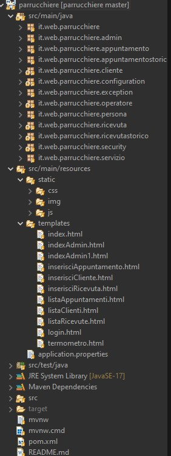
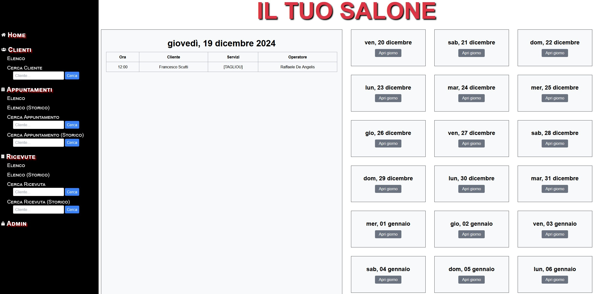
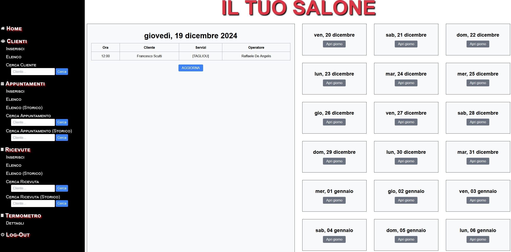
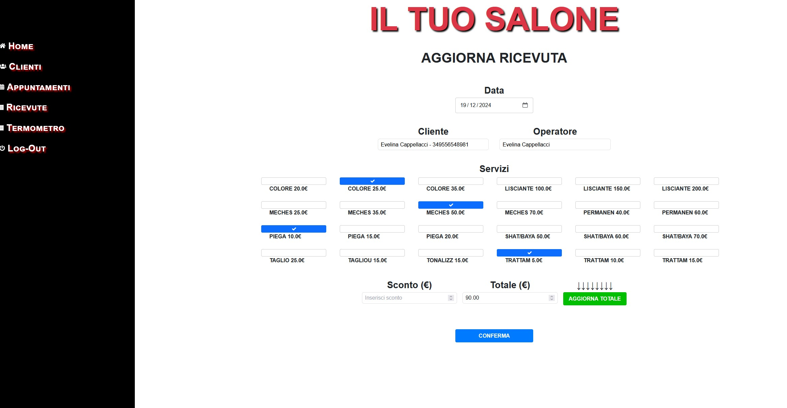
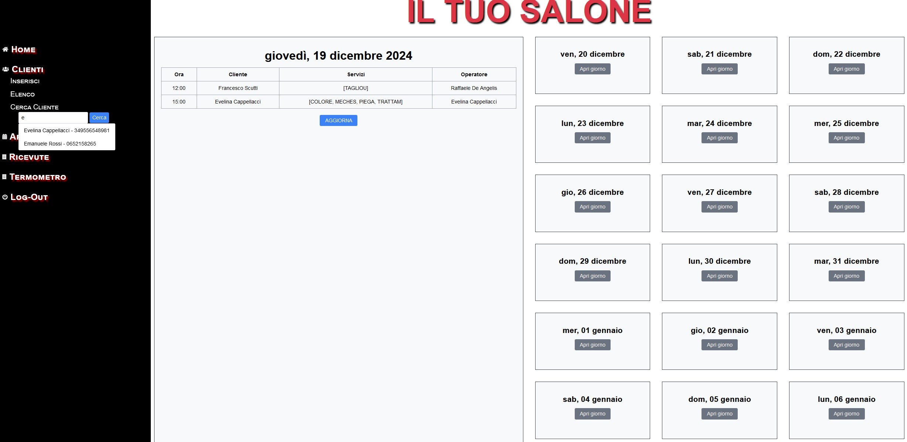
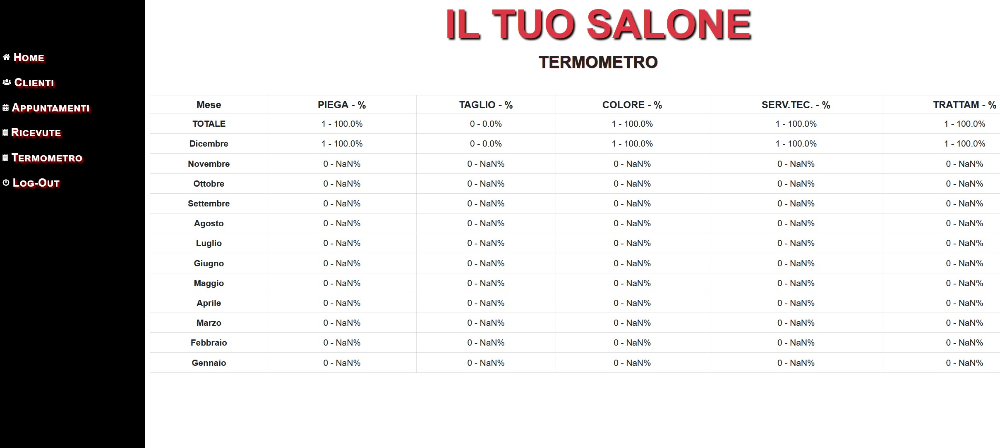

Web App per la gestione di attività commerciali (Salone di Bellezza)

Tecnologie utilizzate: Spring Boot, JPA con MySQL per la persistenza dei dati, Thymeleaf per la parte grafica, e JavaScript per l'automazione di alcune funzionalità.

L'applicazione consente la gestione di un salone di bellezza e offre le seguenti funzionalità principali:

    Operazioni CRUD per la gestione di Clienti, Appuntamenti e Ricevute (accessibili tramite il pannello amministrativo).
    Visualizzazione degli appuntamenti del giorno in tempo reale.
    Generazione automatica delle ricevute direttamente dagli appuntamenti.
    Salvataggio degli appuntamenti e delle ricevute in una tabella di storico per una gestione a lungo termine.
    Monitoraggio dell'andamento dell'attività tramite funzionalità amministrative (accessibili dopo il login, sebbene la gestione della sicurezza tramite Spring Security non sia stata implementata).

L'applicazione è stata sviluppata come parte di un progetto pratico durante il corso di Java, e rappresenta uno dei primi progetti completi e funzionanti. Incoprora funzionalità, come l'integrazione con JPA per la persistenza dei dati e l'uso di Thymeleaf per la gestione delle interfacce utente.

struttura del progetto(Eclipse)

index accessibile senza credenziali

index e funzionalità dopo login admin

form inserimento/aggiornamento ricevuta

funzionalità ricerca clienti tramite iniziali nome (JavaScript)

dettagli andamento dell'attività

